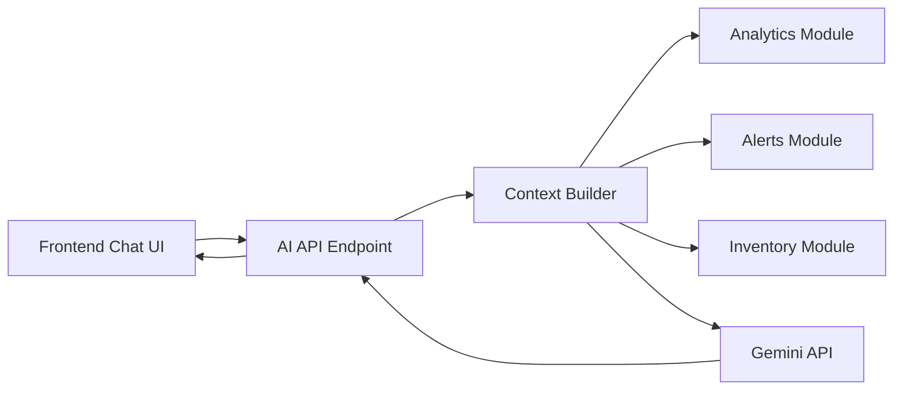

# RetailMind AI AI System Design

## 1. Design Principles
- Use Gemini API for chat responses.
- Use structured business data only.
- Do not use heavy RAG.
- Do not use vector databases.
- Ground every answer in current system data.
- Mention data freshness when analytics data is delayed or stale.

## 2. AI Request Flow


## 3. Strict Context Input Format
```json
{
  "analytics_summary": "analytics_last_updated_at=2026-04-02T10:45:00Z; freshness_status=fresh; today_sales=12450; top_product=Rice 5kg; biscuit_sales_change=-22%",
  "alerts": [
    {
      "alert_id": "alert_013",
      "alert_type": "NOT_SELLING",
      "status": "ACTIVE",
      "severity": "MEDIUM",
      "title": "Biscuit Pack is not selling",
      "message": "No sale recorded in the last 14 days.",
      "source_entity_id": "prod_biscuit_01"
    }
  ],
  "inventory_snapshot": [
    {
      "product_id": "prod_biscuit_01",
      "name": "Biscuit Pack",
      "quantity_on_hand": 47,
      "expiry_date": "2026-07-10T00:00:00Z",
      "expiry_status": "OK"
    }
  ]
}
```

## 4. Context Builder Logic
- Read `analytics_last_updated_at` and freshness status first.
- Fetch a compact analytics summary based on the user question:
  - sales trend summary
  - product performance summary
  - customer insight summary
- Fetch relevant alerts:
  - active alerts first
  - acknowledged alerts if still relevant
- Fetch a focused inventory snapshot:
  - products mentioned in the query
  - products referenced by alerts
  - fallback top products if no product is mentioned
- Convert all fetched data into the strict JSON shape above.
- Do not attach raw database dumps or unrelated records.

## 5. Prompt Structure

### System Prompt
- You are RetailMind AI for a small retail store.
- Use only the provided structured context.
- If the answer is not supported by context, say so clearly.
- Mention freshness if analytics data is delayed or stale.
- Do not invent prices, trends, or reasons that are not in context.

### Context Block
- Insert the strict JSON payload.

### User Prompt
- The original user question from chat.

## 6. Response Rules
- Keep answers short and operational.
- Use business language, not model language.
- Reference trends only if they are present in `analytics_summary`.
- Reference alerts only if they are present in `alerts`.
- Reference stock or expiry only if present in `inventory_snapshot`.
- If freshness is stale:
  - mention that analytics may be delayed
  - still answer from the latest available context
- If data is missing:
  - say what is missing
  - avoid unsupported recommendations

## 7. Example Queries And Structured Reasoning Paths

| User Query | Data Used | Expected Answer Style |
| --- | --- | --- |
| `Why are biscuit sales low this week?` | `analytics_summary` + `alerts` + biscuit inventory row | Explain recent decline, mention not-selling alert, avoid extra causes |
| `What should I restock today?` | `alerts` + `inventory_snapshot` + top-product analytics summary | Recommend low-stock or high-demand items only from current data |
| `Which products may expire soon?` | `alerts` + `inventory_snapshot` | List products with expiry-related signals and quantities |
| `Who are my top customers?` | `analytics_summary` only | Summarize customer insight data and freshness |

## 8. Freshness-Aware Behavior
- If `freshness_status = fresh`, answer normally.
- If `freshness_status = delayed`, add one sentence that analytics may be slightly behind.
- If `freshness_status = stale`, clearly state that analytics data is not current and avoid strong trend conclusions.

Example stale-data phrasing:
- `Analytics data was last updated at 10:45 AM, so this answer uses the latest available summary and may miss very recent sales.`

## 9. Grounding Guardrails
- No answer should mention documents, suppliers, or promotions unless the structured context says so.
- No answer should claim a trend if the context only has current inventory data.
- No answer should hide stale analytics freshness.
- If Gemini returns unsupported text, `response_guard` trims or rejects it.

## 10. Example Output Pattern
```json
{
  "analytics_last_updated_at": "2026-04-02T10:45:00Z",
  "freshness_status": "fresh",
  "answer": "Biscuit sales are low this week because the analytics summary shows a 22 percent drop compared to the previous week, and there is an active not-selling alert for the product.",
  "grounding": {
    "analytics_used": true,
    "alerts_used": [
      "alert_013"
    ],
    "inventory_products_used": [
      "prod_biscuit_01"
    ]
  }
}
```

## 11. Failure Handling
- If analytics context is unavailable, return `AI_CONTEXT_NOT_READY`.
- If Gemini fails, return `AI_PROVIDER_ERROR`.
- If inventory and alerts exist but analytics is stale, answer with freshness notice instead of failing.
