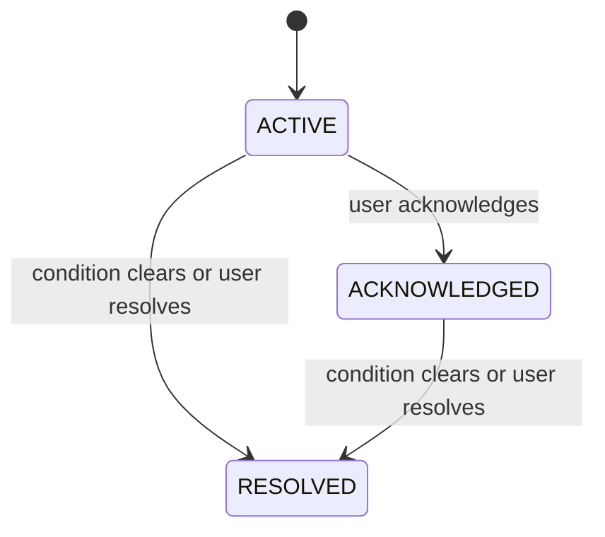

# RetailMind AI Alerts Logic

## 1. Alert Goals
- Highlight urgent store conditions.
- Keep rules simple and explainable.
- Support clear lifecycle tracking.
- Make alerts usable by frontend and AI.

## 2. Alert Status Lifecycle
- `ACTIVE`: rule condition is currently true
- `ACKNOWLEDGED`: user has reviewed the alert
- `RESOLVED`: condition cleared or user resolved the alert



## 3. Required Alert Fields
- `alert_id`
- `store_id`
- `alert_type`
- `condition_key`
- `source_entity_id`
- `status`
- `severity`
- `title`
- `message`
- `created_at`
- `acknowledged_at`
- `acknowledged_by`
- `resolved_at`
- `resolved_by`
- `resolution_note`
- `last_evaluated_at`

## 4. Rule Definitions

| Alert Type | Condition | Severity | Frequency | Clear Condition |
| --- | --- | --- | --- | --- |
| `LOW_STOCK` | `quantity_on_hand <= reorder_threshold` | `HIGH` or `CRITICAL` | Real-time after billing or stock adjustment, plus hourly sweep | `quantity_on_hand > reorder_threshold` |
| `EXPIRY_SOON` | `expiry_date` within next 7 days and stock > 0 | `MEDIUM` or `HIGH` | Daily | product sold out or expiry risk window passed |
| `NOT_SELLING` | product has stock > 0 and no sales in last 14 days | `MEDIUM` | Daily after analytics refresh | product gets new sales or stock becomes 0 |
| `HIGH_DEMAND` | recent 3-day sales rate is at least 1.5x previous baseline or stock cover is below 3 days | `HIGH` | Every 15 minutes after analytics refresh | sales normalize and stock cover improves |

## 5. Alert Creation Logic
- Build one `condition_key` per alert rule and source entity.
- If no open alert exists for that `condition_key`, create a new `ACTIVE` alert.
- If an alert already exists and the condition still holds:
  - keep the current status
  - update `message`, `severity`, and `last_evaluated_at` if needed
- If an alert is `RESOLVED` and the same condition returns later, create a new alert record.

## 6. Lifecycle Transition Logic

### ACTIVE -> ACKNOWLEDGED
- Trigger: user explicitly acknowledges the alert
- Validation: only `ACTIVE` alerts can be acknowledged
- Updates:
  - set `status = ACKNOWLEDGED`
  - set `acknowledged_at`
  - set `acknowledged_by`

### ACTIVE -> RESOLVED
- Trigger:
  - user resolves manually with a note, or
  - system detects that the condition is no longer true
- Updates:
  - set `status = RESOLVED`
  - set `resolved_at`
  - set `resolved_by` to user id or `system`
  - optionally set `resolution_note`

### ACKNOWLEDGED -> RESOLVED
- Trigger:
  - user resolves manually, or
  - system detects that the condition cleared
- Updates:
  - preserve ack history
  - set resolution fields

## 7. Frequency Model

| Alert Type | Mode | Trigger |
| --- | --- | --- |
| `LOW_STOCK` | Real-time | after successful billing or manual stock removal |
| `LOW_STOCK` | Scheduled | hourly reconciliation sweep |
| `EXPIRY_SOON` | Scheduled | daily health job |
| `NOT_SELLING` | Scheduled | daily analytics-based check |
| `HIGH_DEMAND` | Scheduled | every 15 minutes after analytics refresh |

## 8. Example Outputs

### Low Stock
```json
{
  "alert_id": "alert_001",
  "alert_type": "LOW_STOCK",
  "status": "ACTIVE",
  "severity": "HIGH",
  "title": "Rice 5kg stock is low",
  "message": "Only 3 units left. Reorder soon.",
  "created_at": "2026-04-02T10:31:00Z",
  "acknowledged_at": null,
  "resolved_at": null
}
```

### Expiry Soon
```json
{
  "alert_id": "alert_004",
  "alert_type": "EXPIRY_SOON",
  "status": "ACTIVE",
  "severity": "MEDIUM",
  "title": "Milk Pack expires soon",
  "message": "12 units expire within 3 days.",
  "created_at": "2026-04-02T05:00:00Z",
  "acknowledged_at": null,
  "resolved_at": null
}
```

### Resolved Alert
```json
{
  "alert_id": "alert_001",
  "alert_type": "LOW_STOCK",
  "status": "RESOLVED",
  "severity": "HIGH",
  "title": "Rice 5kg stock is low",
  "message": "Only 3 units left. Reorder soon.",
  "created_at": "2026-04-02T10:31:00Z",
  "acknowledged_at": "2026-04-02T11:00:00Z",
  "resolved_at": "2026-04-02T12:00:00Z",
  "resolved_by": "user_001",
  "resolution_note": "New stock received"
}
```

## 9. Deduplication And History Rules
- Only one non-resolved alert should exist for a single `condition_key`.
- Every status transition writes an event into `alerts/{alert_id}/events`.
- Resolved alerts remain queryable for history and analytics.

## 10. Frontend And AI Usage
- Frontend shows alert list, status, severity, and available actions.
- Frontend can acknowledge and resolve alerts through API calls.
- AI consumes active and acknowledged alerts when they are still relevant to a user question.
