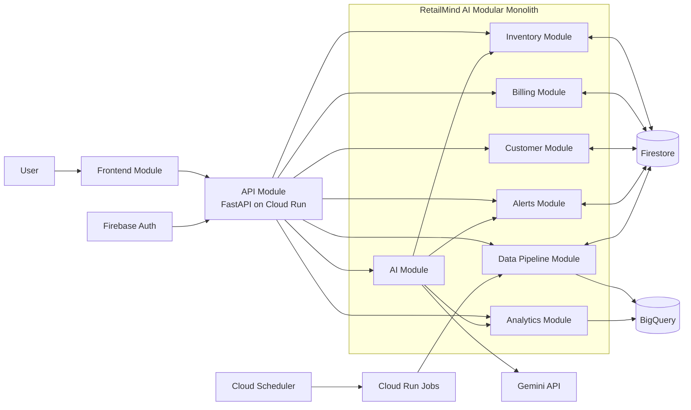
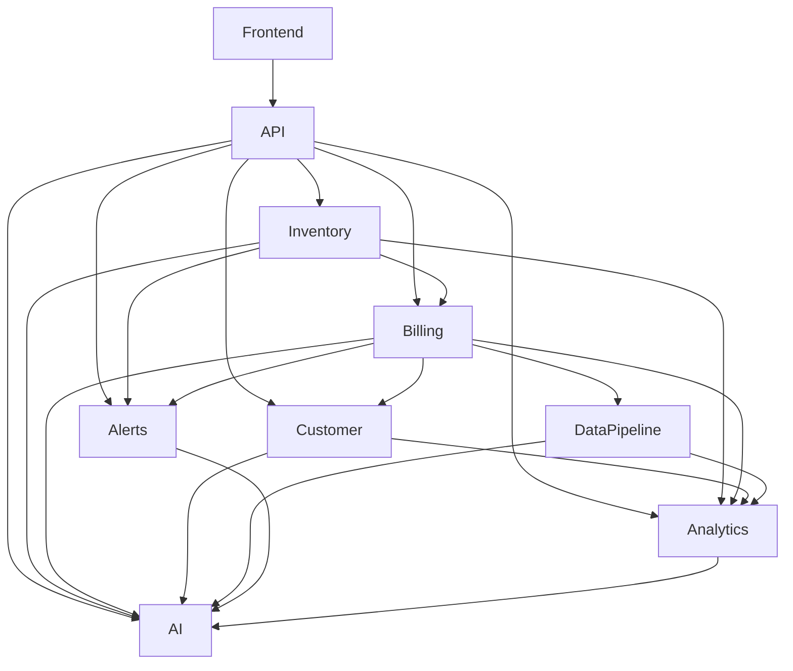

# RetailMind AI Architecture Overview

## 1. Architecture Summary
- Architecture style: modular monolith
- Backend stack: FastAPI on Cloud Run
- Worker stack: Cloud Run Jobs triggered by Cloud Scheduler
- Operational database: Firestore
- Analytics warehouse: BigQuery
- AI provider: Gemini API
- Auth: Firebase Auth with `admin` and `staff` roles
- Scope: single-store MVP, tenant-ready with `store_id` on all major records

## 2. Core Design Principles
- Keep the 9 modules independent inside one codebase.
- Use Firestore for live operational reads and writes.
- Use BigQuery for reporting, trends, and AI-ready summaries.
- Keep billing strictly atomic and retry-safe.
- Use structured data for AI instead of heavy RAG or vector search.
- Show freshness everywhere analytics data is used.

## 3. High-Level System Architecture


## 4. Module Interaction Diagram


## 5. End-to-End Data Flow
- User action starts in the Frontend Module.
- Frontend sends a REST request to the API Module.
- API validates auth, payload, and store scope.
- API routes the request to the correct module service.
- Inventory, Billing, Customer, and Alerts read or write live data in Firestore.
- Billing writes transactions and stock deductions in one atomic Firestore transaction.
- Data Pipeline reads changed Firestore records on a schedule and loads BigQuery raw tables.
- Pipeline builds BigQuery marts and updates `analytics_last_updated_at`.
- Analytics reads BigQuery marts plus freshness metadata.
- AI builds structured context from analytics, alerts, and inventory, then calls Gemini.
- API returns JSON back to the frontend.

## 6. Real-Time vs Batch Processing

| Area | Real-Time | Batch / Scheduled |
| --- | --- | --- |
| Inventory | Product create, update, stock adjustment | Daily inventory health snapshot to BigQuery |
| Billing | Atomic transaction creation and stock deduction | Transaction sync to BigQuery every 15 minutes |
| Customer | Customer create and transaction linking | Customer summary refresh every 15 minutes |
| Alerts | Low stock check after billing or stock update | Expiry, not selling, and high-demand sweeps |
| Analytics | Read latest mart tables through API | Aggregate rebuild every 15 minutes, nightly repair job |
| AI | Chat request, context building, Gemini call | No batch inference in MVP |
| Data Pipeline | Checkpoint tracking | Incremental sync, retry, and recovery jobs |

## 7. Tech Stack Mapping By Module

| Module | Runtime Layer | Main Storage / Integration | Notes |
| --- | --- | --- | --- |
| Inventory | FastAPI service layer | Firestore | Stores products, stock, expiry |
| Billing | FastAPI service layer | Firestore transactions | Atomic billing and idempotency |
| Customer | FastAPI service layer | Firestore | Customer profile and purchase history |
| Analytics | FastAPI query layer | BigQuery + Firestore metadata | Reads marts and freshness info |
| Alerts | FastAPI + worker logic | Firestore | Real-time and scheduled alerts |
| AI | FastAPI orchestration | Gemini API + structured data | No vector DB, no heavy RAG |
| Data Pipeline | Cloud Run Jobs | Firestore + BigQuery | Incremental sync and transforms |
| API | FastAPI routers and middleware | Firebase Auth | Validation, routing, response formatting |
| Frontend | Web app | API + Firebase Auth | Dashboard, billing, alerts, chat |

## 8. Cross-Cutting Rules
- Atomic billing: if any billing line item fails stock validation, the full transaction fails and no stock changes are committed.
- Idempotency: billing requests require `idempotency_key`; same key plus same payload returns the original result, same key plus different payload returns conflict.
- Freshness: analytics responses always carry `analytics_last_updated_at` and a freshness status.
- Alert lifecycle: every alert moves through `ACTIVE`, `ACKNOWLEDGED`, and `RESOLVED`.
- Reliability: pipeline jobs retry up to 3 times, log failures, and push exhausted batches into a dead-letter or failure store.
- Observability: every API request and pipeline run uses `request_id` or `pipeline_run_id` for logs and tracing.
- Simplicity: keep one deployable backend application boundary; do not split into microservices for MVP.

## 9. Suggested Deployment Layout
- `api-service`
  - Cloud Run service for FastAPI APIs
  - Handles auth, module routing, live Firestore access, and Gemini requests
- `pipeline-sync-job`
  - Cloud Run Job for incremental Firestore to BigQuery sync
- `pipeline-transform-job`
  - Cloud Run Job for mart refresh and analytics metadata update
- `pipeline-repair-job`
  - Nightly Cloud Run Job for checkpoint repair and failed-window reprocessing

## 10. Recommended Folder Structure
```text
retailmind-ai/
  backend/
    app/
      api/
      modules/
        inventory/
        billing/
        customer/
        analytics/
        alerts/
        ai/
        data_pipeline/
      common/
  frontend/
  docs/
```
