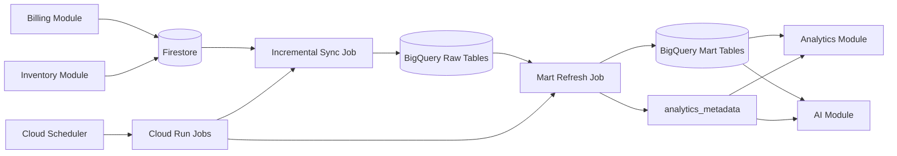

# RetailMind AI Data Pipeline Design

## 1. Pipeline Goal
- Move operational data from Firestore into BigQuery reliably.
- Build analytics-ready tables for dashboards and AI context.
- Keep freshness visible through `analytics_last_updated_at`.
- Recover safely from transient failures without creating duplicate analytics rows.

## 2. Main Flow

## 3. Data Flow: Billing -> Firestore -> BigQuery -> Analytics -> AI

### Step 1. Operational write
- Billing writes completed transactions into Firestore.
- Inventory writes product and stock changes into Firestore.
- Billing and inventory changes update `updated_at` fields so the pipeline can read incrementally.

### Step 2. Incremental sync to raw layer
- Cloud Scheduler triggers `pipeline-sync-job` every 15 minutes.
- Sync job reads Firestore records changed since the last successful checkpoint.
- Sync job writes:
  - `transactions_raw`
  - `transaction_items_raw`
  - `inventory_snapshot_raw`
  - `customers_raw`
  - `alerts_raw`

### Step 3. Transform raw to marts
- After a successful raw load, `pipeline-transform-job` refreshes mart tables.
- SQL transformations compute:
  - daily sales
  - product performance
  - customer summaries
  - inventory health
  - dashboard summary

### Step 4. Update freshness metadata
- On successful mart refresh, pipeline updates Firestore `analytics_metadata`.
- `analytics_last_updated_at` reflects the latest finished mart refresh.
- Analytics API and AI context builder read this field.

### Step 5. Serve analytics and AI
- Analytics Module reads BigQuery marts and returns frontend-ready data.
- AI Module reads analytics summary, alerts, and inventory snapshots to build structured Gemini context.

## 4. Transformation Steps
- Extract changed Firestore documents by checkpoint window.
- Normalize nested Firestore billing items into `transaction_items_raw`.
- Snapshot current inventory state for inventory health reporting.
- Deduplicate by natural keys such as `transaction_id` and `product_id + captured_at`.
- Run SQL transforms to build mart tables.
- Stamp mart rows with `analytics_last_updated_at`.

## 5. Batch vs Real-Time Responsibilities

| Responsibility | Real-Time | Batch |
| --- | --- | --- |
| Billing and stock deduction | Yes | No |
| Low stock alert after sale | Yes | No |
| Firestore to BigQuery sync | No | Every 15 minutes |
| Mart refresh | No | Every 15 minutes |
| Not selling analysis | No | Daily |
| Full repair / backfill | No | Nightly |

## 6. Scheduling Plan

| Job | Frequency | Purpose |
| --- | --- | --- |
| `pipeline-sync-job` | Every 15 minutes | Firestore incremental extract and BigQuery raw load |
| `pipeline-transform-job` | Every 15 minutes after sync | BigQuery mart refresh and freshness update |
| `alert-analytics-job` | Every 15 minutes | High-demand and trend-based alerts after fresh analytics |
| `daily-health-job` | Daily | Expiry checks, slow-moving checks, and daily repair |
| `pipeline-repair-job` | Nightly | Reprocess failed windows and verify checkpoints |

## 7. Reliability And Retry Strategy
- Each pipeline stage retries up to 3 times.
- Backoff pattern:
  - attempt 1: immediate retry
  - attempt 2: retry after 1 minute
  - attempt 3: retry after 5 minutes
- If all retries fail:
  - mark `pipeline_runs.status = FAILED`
  - write the failed batch into `pipeline_failures`
  - keep the last successful checkpoint unchanged
  - alert logs and admin dashboard can show the failure

## 8. Failure Handling Strategy

### If sync to BigQuery raw fails
- Raw load batch is not marked successful.
- `pipeline_failures` stores the batch reference and error message.
- Next scheduled run can retry the same checkpoint window safely.

### If mart refresh fails
- Existing mart tables remain available for reads.
- `analytics_last_updated_at` is not updated.
- Frontend and AI see older freshness status and can communicate stale data clearly.

### If BigQuery is temporarily unavailable
- Retry policy applies first.
- After retry exhaustion, failed window is preserved for repair job.
- Recovery job reprocesses the last incomplete window from Firestore using the same checkpoint rules.

## 9. Dead-Letter / Failure Store Concept
- Use Firestore `pipeline_failures` collection for exhausted-retry metadata.
- Optionally mirror failed batch metadata into a BigQuery `pipeline_failures_audit` table later.
- Store:
  - failed batch reference
  - source module
  - failure stage
  - retry count
  - error message
  - recovery status

## 10. Recovery Logic
- Resume from the last successful checkpoint.
- Re-read the failed checkpoint window.
- Use idempotent upsert logic into BigQuery raw tables.
- Re-run mart transformations for the repaired window.
- Update `analytics_last_updated_at` only after recovery completes successfully.

## 11. Freshness Propagation
- `analytics_last_updated_at` is written only after successful mart completion.
- Analytics responses return this field on every endpoint.
- Frontend shows this timestamp on dashboards and charts.
- AI includes freshness in prompt context and answer phrasing.

## 12. Worker Ownership
- `pipeline-sync-job`: extract and load raw data
- `pipeline-transform-job`: build mart tables and update metadata
- `pipeline-repair-job`: retry failed windows and mark recovered failures
