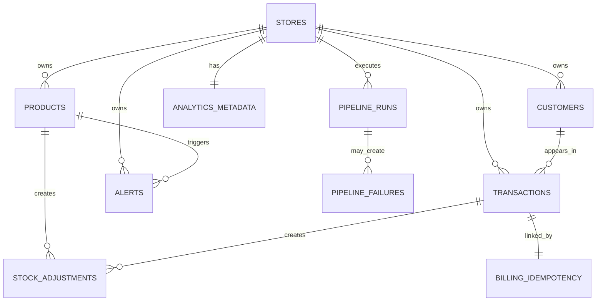

# RetailMind AI Database Design

## 1. Storage Strategy
- Firestore stores operational data that changes frequently.
- BigQuery stores analytical data for trends, aggregation, and dashboards.
- Firestore is the source of truth for transactions, stock, customers, alerts, and pipeline state.
- BigQuery is the source of truth for reporting and AI summary context.

## 2. Why Firestore vs BigQuery

| Need | Firestore | BigQuery |
| --- | --- | --- |
| Fast operational reads and writes | Yes | No |
| Atomic billing transaction | Yes | No |
| Real-time inventory and alerts | Yes | No |
| Large trend queries and aggregations | Limited | Yes |
| Dashboard and product analytics | Limited | Yes |
| AI summary context generation | Partial | Yes |

## 3. Firestore Collections

### `stores`
- Purpose: store-level metadata

| Field | Type | Notes |
| --- | --- | --- |
| `store_id` | string | document id |
| `name` | string | store name |
| `timezone` | string | local timezone |
| `currency` | string | default `INR` |
| `created_at` | timestamp | creation time |

Example document:
```json
{
  "store_id": "store_001",
  "name": "RetailMind Demo Store",
  "timezone": "Asia/Kolkata",
  "currency": "INR",
  "created_at": "2026-04-02T09:00:00Z"
}
```

### `products`
- Purpose: live product and stock state

| Field | Type | Notes |
| --- | --- | --- |
| `product_id` | string | document id |
| `store_id` | string | store scope |
| `name` | string | product name |
| `category` | string | optional category |
| `price` | number | selling price |
| `quantity_on_hand` | integer | current stock |
| `reorder_threshold` | integer | low stock threshold |
| `expiry_date` | timestamp or null | optional |
| `expiry_status` | string | `OK`, `EXPIRING_SOON`, `EXPIRED` |
| `status` | string | `ACTIVE` or `INACTIVE` |
| `created_at` | timestamp | created time |
| `updated_at` | timestamp | last update |

Example document:
```json
{
  "product_id": "prod_rice_5kg",
  "store_id": "store_001",
  "name": "Rice 5kg",
  "category": "Grocery",
  "price": 320.0,
  "quantity_on_hand": 35,
  "reorder_threshold": 8,
  "expiry_date": "2026-06-30T00:00:00Z",
  "expiry_status": "OK",
  "status": "ACTIVE",
  "created_at": "2026-04-02T10:00:00Z",
  "updated_at": "2026-04-02T10:20:00Z"
}
```

### `stock_adjustments`
- Purpose: audit trail for manual stock changes and billing deductions

| Field | Type | Notes |
| --- | --- | --- |
| `adjustment_id` | string | document id |
| `store_id` | string | store scope |
| `product_id` | string | related product |
| `adjustment_type` | string | `ADD`, `REMOVE`, `SALE_DEDUCTION`, `MANUAL_CORRECTION` |
| `quantity_delta` | integer | positive or negative |
| `reason` | string | human-readable reason |
| `source_ref` | string | transaction id or manual action id |
| `created_by` | string | user id or system |
| `created_at` | timestamp | event time |

### `transactions`
- Purpose: billing records

| Field | Type | Notes |
| --- | --- | --- |
| `transaction_id` | string | document id |
| `store_id` | string | store scope |
| `idempotency_key` | string | unique per store |
| `customer_id` | string or null | optional |
| `status` | string | `COMPLETED` or `FAILED` |
| `payment_method` | string | `cash`, `upi`, `card` |
| `total_amount` | number | bill total |
| `items` | array of map | line items with product snapshot |
| `sale_timestamp` | timestamp | bill time |
| `created_by` | string | user id |
| `created_at` | timestamp | write time |

Example document:
```json
{
  "transaction_id": "txn_001",
  "store_id": "store_001",
  "idempotency_key": "bill_20260402_0001",
  "customer_id": "cust_001",
  "status": "COMPLETED",
  "payment_method": "cash",
  "total_amount": 745.0,
  "items": [
    {
      "product_id": "prod_rice_5kg",
      "product_name": "Rice 5kg",
      "quantity": 2,
      "unit_price": 320.0,
      "line_total": 640.0
    },
    {
      "product_id": "prod_biscuit_01",
      "product_name": "Biscuit Pack",
      "quantity": 3,
      "unit_price": 35.0,
      "line_total": 105.0
    }
  ],
  "sale_timestamp": "2026-04-02T10:30:00Z",
  "created_by": "user_001",
  "created_at": "2026-04-02T10:30:00Z"
}
```

### `billing_idempotency`
- Purpose: safe retry control for billing

| Field | Type | Notes |
| --- | --- | --- |
| `idempotency_record_id` | string | composite doc id, for example `store_001_bill_20260402_0001` |
| `store_id` | string | store scope |
| `idempotency_key` | string | client-supplied key |
| `request_hash` | string | hash of request payload |
| `transaction_id` | string or null | linked transaction |
| `result_status` | string | `COMPLETED` or `FAILED` |
| `response_snapshot` | map | stored response payload |
| `created_at` | timestamp | first seen time |
| `last_seen_at` | timestamp | retry time |

### `customers`
- Purpose: customer profile and summary state

| Field | Type | Notes |
| --- | --- | --- |
| `customer_id` | string | document id |
| `store_id` | string | store scope |
| `name` | string | customer name |
| `phone` | string | unique per store if used |
| `total_spend` | number | running total |
| `visit_count` | integer | number of completed transactions |
| `last_purchase_at` | timestamp or null | latest purchase |
| `created_at` | timestamp | creation time |
| `updated_at` | timestamp | last update |

### `alerts`
- Purpose: current alert state

| Field | Type | Notes |
| --- | --- | --- |
| `alert_id` | string | document id |
| `store_id` | string | store scope |
| `alert_type` | string | `LOW_STOCK`, `EXPIRY_SOON`, `NOT_SELLING`, `HIGH_DEMAND` |
| `condition_key` | string | dedupe key per alert condition |
| `source_entity_id` | string | product id or aggregate key |
| `status` | string | `ACTIVE`, `ACKNOWLEDGED`, `RESOLVED` |
| `severity` | string | `LOW`, `MEDIUM`, `HIGH`, `CRITICAL` |
| `title` | string | short text |
| `message` | string | UI text |
| `metadata` | map | rule-specific values |
| `created_at` | timestamp | alert created |
| `acknowledged_at` | timestamp or null | ack time |
| `acknowledged_by` | string or null | actor |
| `resolved_at` | timestamp or null | resolved time |
| `resolved_by` | string or null | actor |
| `resolution_note` | string or null | manual note |
| `last_evaluated_at` | timestamp | last rule check |

Example document:
```json
{
  "alert_id": "alert_001",
  "store_id": "store_001",
  "alert_type": "LOW_STOCK",
  "condition_key": "LOW_STOCK_prod_rice_5kg",
  "source_entity_id": "prod_rice_5kg",
  "status": "ACTIVE",
  "severity": "HIGH",
  "title": "Rice 5kg stock is low",
  "message": "Only 3 units left. Reorder soon.",
  "metadata": {
    "quantity_on_hand": 3,
    "reorder_threshold": 8
  },
  "created_at": "2026-04-02T10:31:00Z",
  "acknowledged_at": null,
  "acknowledged_by": null,
  "resolved_at": null,
  "resolved_by": null,
  "resolution_note": null,
  "last_evaluated_at": "2026-04-02T10:31:00Z"
}
```

### `alerts/{alert_id}/events`
- Purpose: alert lifecycle audit log

| Field | Type | Notes |
| --- | --- | --- |
| `event_id` | string | subdocument id |
| `from_status` | string | previous state |
| `to_status` | string | new state |
| `changed_by` | string | user id or system |
| `note` | string or null | optional reason |
| `changed_at` | timestamp | transition time |

### `analytics_metadata`
- Purpose: freshness and mart status

| Field | Type | Notes |
| --- | --- | --- |
| `metadata_id` | string | one doc per store, for example `store_001_dashboard` |
| `store_id` | string | store scope |
| `analytics_last_updated_at` | timestamp | latest successful mart refresh |
| `freshness_status` | string | `fresh`, `delayed`, `stale` |
| `last_pipeline_run_id` | string | latest successful pipeline run |
| `source_window_start` | timestamp | start of included data |
| `source_window_end` | timestamp | end of included data |
| `updated_at` | timestamp | metadata update time |

### `pipeline_runs`
- Purpose: pipeline execution log

| Field | Type | Notes |
| --- | --- | --- |
| `pipeline_run_id` | string | document id |
| `store_id` | string | store scope |
| `run_type` | string | `INCREMENTAL_SYNC`, `MART_REFRESH`, `REPAIR` |
| `status` | string | `QUEUED`, `RUNNING`, `SUCCEEDED`, `FAILED` |
| `attempt_count` | integer | retry count |
| `checkpoint_start` | timestamp | read window start |
| `checkpoint_end` | timestamp | read window end |
| `records_read` | integer | raw input count |
| `records_written` | integer | output count |
| `failure_stage` | string or null | stage that failed |
| `error_message` | string or null | failure reason |
| `started_at` | timestamp | start time |
| `finished_at` | timestamp or null | finish time |

### `pipeline_failures`
- Purpose: dead-letter or exhausted-retry batches

| Field | Type | Notes |
| --- | --- | --- |
| `failure_id` | string | document id |
| `pipeline_run_id` | string | failed run |
| `store_id` | string | store scope |
| `source_module` | string | `Billing` or `Inventory` |
| `batch_ref` | string | failed batch reference |
| `retry_count` | integer | final retry count |
| `failure_stage` | string | stage name |
| `dead_letter_status` | string | `OPEN`, `REPROCESSING`, `RECOVERED` |
| `error_message` | string | failure cause |
| `created_at` | timestamp | failure time |
| `recovered_at` | timestamp or null | recovery time |

### `ai_chat_sessions`
- Purpose: optional chat session tracking

| Field | Type | Notes |
| --- | --- | --- |
| `chat_session_id` | string | document id |
| `store_id` | string | store scope |
| `user_id` | string | current user |
| `created_at` | timestamp | session start |
| `last_query_at` | timestamp | latest message |

## 4. BigQuery Datasets And Tables

### Dataset: `retailmind_raw`
- Purpose: near-source copies from Firestore

#### Table: `transactions_raw`
| Field | Type |
| --- | --- |
| `transaction_id` | STRING |
| `store_id` | STRING |
| `customer_id` | STRING |
| `idempotency_key` | STRING |
| `total_amount` | NUMERIC |
| `payment_method` | STRING |
| `sale_timestamp` | TIMESTAMP |
| `created_at` | TIMESTAMP |

#### Table: `transaction_items_raw`
| Field | Type |
| --- | --- |
| `transaction_id` | STRING |
| `store_id` | STRING |
| `product_id` | STRING |
| `product_name` | STRING |
| `quantity` | INT64 |
| `unit_price` | NUMERIC |
| `line_total` | NUMERIC |
| `sale_timestamp` | TIMESTAMP |

#### Table: `inventory_snapshot_raw`
| Field | Type |
| --- | --- |
| `snapshot_id` | STRING |
| `store_id` | STRING |
| `product_id` | STRING |
| `product_name` | STRING |
| `quantity_on_hand` | INT64 |
| `reorder_threshold` | INT64 |
| `expiry_date` | TIMESTAMP |
| `captured_at` | TIMESTAMP |

#### Table: `customers_raw`
| Field | Type |
| --- | --- |
| `customer_id` | STRING |
| `store_id` | STRING |
| `name` | STRING |
| `phone` | STRING |
| `total_spend` | NUMERIC |
| `visit_count` | INT64 |
| `last_purchase_at` | TIMESTAMP |
| `captured_at` | TIMESTAMP |

#### Table: `alerts_raw`
| Field | Type |
| --- | --- |
| `alert_id` | STRING |
| `store_id` | STRING |
| `alert_type` | STRING |
| `status` | STRING |
| `severity` | STRING |
| `source_entity_id` | STRING |
| `created_at` | TIMESTAMP |
| `resolved_at` | TIMESTAMP |
| `captured_at` | TIMESTAMP |

### Dataset: `retailmind_mart`
- Purpose: frontend-ready and AI-ready aggregates

#### Table: `dashboard_summary`
| Field | Type |
| --- | --- |
| `store_id` | STRING |
| `snapshot_date` | DATE |
| `today_sales` | NUMERIC |
| `today_transactions` | INT64 |
| `active_alert_count` | INT64 |
| `low_stock_count` | INT64 |
| `top_selling_product` | STRING |
| `analytics_last_updated_at` | TIMESTAMP |

#### Table: `sales_daily`
| Field | Type |
| --- | --- |
| `store_id` | STRING |
| `sales_date` | DATE |
| `total_sales` | NUMERIC |
| `transaction_count` | INT64 |
| `average_basket_value` | NUMERIC |
| `analytics_last_updated_at` | TIMESTAMP |

#### Table: `product_sales_daily`
| Field | Type |
| --- | --- |
| `store_id` | STRING |
| `sales_date` | DATE |
| `product_id` | STRING |
| `product_name` | STRING |
| `quantity_sold` | INT64 |
| `revenue` | NUMERIC |
| `analytics_last_updated_at` | TIMESTAMP |

#### Table: `customer_summary`
| Field | Type |
| --- | --- |
| `store_id` | STRING |
| `customer_id` | STRING |
| `customer_name` | STRING |
| `lifetime_spend` | NUMERIC |
| `visit_count` | INT64 |
| `last_purchase_at` | TIMESTAMP |
| `analytics_last_updated_at` | TIMESTAMP |

#### Table: `inventory_health`
| Field | Type |
| --- | --- |
| `store_id` | STRING |
| `snapshot_date` | DATE |
| `product_id` | STRING |
| `product_name` | STRING |
| `quantity_on_hand` | INT64 |
| `reorder_threshold` | INT64 |
| `days_to_expiry` | INT64 |
| `is_low_stock` | BOOL |
| `analytics_last_updated_at` | TIMESTAMP |

## 5. Relationships
- `stores.store_id` links to every operational and analytical record.
- `products.product_id` is referenced by `stock_adjustments`, `transactions.items`, `alerts`, and BigQuery inventory or sales tables.
- `transactions.customer_id` links to `customers.customer_id`.
- `alerts.source_entity_id` usually points to a `product_id`.
- `billing_idempotency.transaction_id` links to `transactions.transaction_id`.
- `analytics_metadata.last_pipeline_run_id` links to `pipeline_runs.pipeline_run_id`.
- BigQuery mart tables derive from raw tables, not directly from API requests.

## 6. Consistency Rules
- Billing writes product stock changes, stock adjustment logs, transaction record, and idempotency record in one Firestore transaction.
- Failed billing requests do not mutate product stock.
- Each `idempotency_key` is unique per `store_id`.
- `condition_key` prevents duplicate active alerts for the same rule and entity.
- `analytics_last_updated_at` is updated only after a successful mart refresh.
- Pipeline reprocessing uses checkpoint windows so duplicate loads can be merged safely.

## 7. Example BigQuery Row
```json
{
  "store_id": "store_001",
  "sales_date": "2026-04-02",
  "product_id": "prod_rice_5kg",
  "product_name": "Rice 5kg",
  "quantity_sold": 48,
  "revenue": 15360.0,
  "analytics_last_updated_at": "2026-04-02T10:45:00Z"
}
```

## 8. Simplified Data Relationship Diagram

