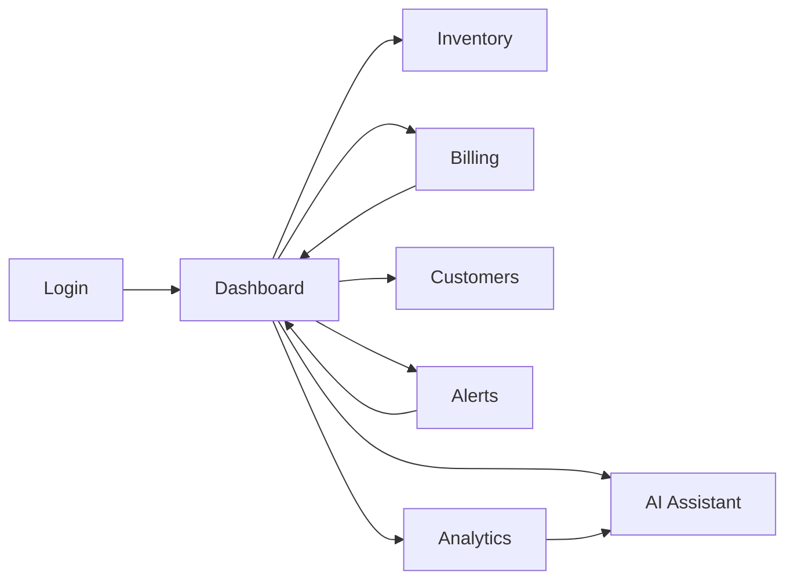

# RetailMind AI Frontend Plan

## 1. Frontend Goals
- Keep the UI simple for small store operators.
- Make key actions fast: add stock, bill sale, view alerts, ask AI.
- Show freshness clearly for analytics and AI.
- Keep module screens aligned with backend APIs.

## 2. Main Screens

| Screen | Purpose | Main APIs |
| --- | --- | --- |
| Login | Authenticate admin or staff | Firebase Auth, `/api/v1/me` |
| Dashboard | Show store summary, alerts, freshness | `/api/v1/analytics/dashboard`, `/api/v1/alerts/summary` |
| Inventory | Manage products and stock | `/api/v1/inventory/products`, `/api/v1/inventory/products/{product_id}/stock-adjustments` |
| Billing | Create bills and deduct stock | `/api/v1/billing/transactions` |
| Customers | View customer list and purchase history | `/api/v1/customers`, `/api/v1/customers/{customer_id}/purchase-history` |
| Alerts | View, acknowledge, resolve alerts | `/api/v1/alerts`, `/api/v1/alerts/{alert_id}/acknowledge`, `/api/v1/alerts/{alert_id}/resolve` |
| Analytics | View trends and product performance | `/api/v1/analytics/sales-trends`, `/api/v1/analytics/product-performance`, `/api/v1/analytics/customer-insights` |
| AI Assistant | Ask business questions | `/api/v1/ai/chat`, `/api/v1/ai/chat/sessions/{chat_session_id}` |

## 3. High-Level UI Flow

## 4. Dashboard Design
- Top cards:
  - today sales
  - total transactions
  - active alerts
  - low stock count
- Show `analytics_last_updated_at` under the summary cards.
- Add a freshness badge:
  - `Fresh`
  - `Delayed`
  - `Stale`
- Show quick links to:
  - low stock products
  - active alerts
  - AI chat

## 5. Inventory Screen
- Product table with:
  - name
  - price
  - quantity
  - expiry date
  - expiry status
- Actions:
  - add product
  - edit product
  - adjust stock
- Highlight:
  - low stock rows
  - expiring soon rows

## 6. Billing Screen
- Layout:
  - product picker
  - cart items
  - quantity controls
  - customer selector
  - payment method
  - bill summary
- Frontend generates `idempotency_key` before submit.
- On submit:
  - disable repeated clicks
  - send one billing request
  - if timeout happens, safe retry with same `idempotency_key`
- If billing fails because of insufficient stock:
  - show one clear error
  - do not show partial success

## 7. Customers Screen
- Customer list with total spend and last purchase
- Customer detail panel with purchase history
- Top-customer insights can link into analytics views later

## 8. Alerts Screen
- Filter by:
  - status
  - alert type
  - severity
- Card or table view should show:
  - title
  - message
  - status
  - created time
  - acknowledged time
  - resolved time
- Actions:
  - acknowledge
  - resolve
- Resolved alerts stay visible in history view

## 9. Analytics Screen
- Tabs:
  - sales trends
  - product performance
  - customer insights
- Every chart section shows:
  - `analytics_last_updated_at`
  - freshness badge
- If freshness is stale:
  - keep charts visible
  - show a warning note instead of hiding data

## 10. AI Chat UI Design
- Simple chat panel on its own page and optional dashboard side panel
- Components:
  - chat history list
  - question input
  - send button
  - grounding footer
- Show under each AI answer:
  - freshness note from analytics
  - small grounding hints such as active alert count or products referenced
- If analytics is stale:
  - show a visible note before or with the AI answer

## 11. API Integration Notes
- Use one shared API client for auth headers and error handling.
- Reuse response models from `api_contracts.md`.
- Store `request_id` for debugging failed actions.
- Do not call Firestore or BigQuery directly from frontend in MVP.

## 12. UX Rules
- Keep primary actions reachable in 1-2 clicks from the dashboard.
- Use simple language like `Low Stock` and `Expiring Soon`.
- Show clear success and failure messages.
- Never hide the reason for a failed bill.
- Keep charts readable on mobile and desktop.
