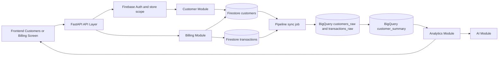

# Customer Module System Map

## Purpose
- This document consolidates the planning material under `Planning/` and maps the Customer Module into the current repository structure.
- The goal is to show how `customer_implementation.md` fits into the full RetailMind AI system, including API flow, storage, analytics, AI, frontend usage, and current code ownership.

## Planning Sources Reviewed
- `Planning/customer_implementation.md`
- `Planning/shared_business_rules.md`
- `Planning/naming_and_conventions.md`
- `Planning/coding_instructions.txt`
- `Planning/markdowns-20260417T134608Z-3-001/markdowns/architecture_overview.md`
- `Planning/markdowns-20260417T134608Z-3-001/markdowns/api_contracts.md`
- `Planning/markdowns-20260417T134608Z-3-001/markdowns/database_design.md`
- `Planning/markdowns-20260417T134608Z-3-001/markdowns/data_pipeline_design.md`
- `Planning/markdowns-20260417T134608Z-3-001/markdowns/ai_system_design.md`
- `Planning/markdowns-20260417T134608Z-3-001/markdowns/alerts_logic.md`
- `Planning/markdowns-20260417T134608Z-3-001/markdowns/frontend_plan.md`
- `Planning/github_workflow_for_team.pdf`

## Important Traceability Notes
- `customer_implementation.md` and `coding_instructions.txt` both reference `module_breakdown.md`, but that file is not present in the current workspace.
- `docs/feature/api-foundation/remaining.md` references `implementation_roadmap.md`, but that file is also not present in the current workspace.
- The workflow PDF was partially inspected through its embedded outline headings. The visible sections confirm the intended team workflow topics: purpose, source of truth, official feature branches, merge order, small PR size, daily branch workflow, PR guidance, merge conflict handling, and team rules.

## Current Repository Mapping

| Planned Area | Current Repo Path | Current Status |
| --- | --- | --- |
| API Module | `backend/app/main.py`, `backend/app/api/platform.py` | Implemented foundation and router mounting |
| Shared auth and request flow | `backend/app/common/auth.py`, `backend/app/common/middleware.py`, `backend/app/common/responses.py`, `backend/app/common/exceptions.py` | Implemented |
| Customer Module | `backend/app/modules/customer/router.py` | Stub only |
| Billing Module | `backend/app/modules/billing/router.py` | Stub only |
| Analytics Module | `backend/app/modules/analytics/router.py` | Stub only |
| Alerts Module | `backend/app/modules/alerts/router.py` | Stub only |
| Inventory Module | `backend/app/modules/inventory/router.py` | Stub only |
| AI Module | `backend/app/modules/ai/router.py` | Stub only |
| Data Pipeline Module | `backend/app/modules/data_pipeline/router.py` | Stub only |
| Tests | `backend/tests/test_api_foundation.py` | Covers platform and shared API foundation only |
| Code-facing docs | `docs/` | Minimal docs exist; this file extends that set |

## Customer Module Role In The Planned Architecture
- Module goal: store customer profiles and expose customer-wise sales history.
- Direct responsibilities:
  - create or update customer records
  - list customers
  - return a single customer profile
  - return purchase history by reading `transactions`
  - maintain summary fields on the customer document: `total_spend`, `visit_count`, `last_purchase_at`
- Explicit rule boundaries:
  - customer linking is optional during billing
  - customer summary is updated only from completed transactions
  - purchase history must come from `transactions`, not copied arrays on the customer document
  - every record stays store-scoped with `store_id`

## End-To-End Customer Flow In The Whole System

## Request And Response Flow In The Current Codebase
1. The frontend calls a route under `/api/v1/customers` from the Customers screen or indirectly links a customer through `/api/v1/billing/transactions`.
2. `backend/app/main.py` mounts `backend/app/modules/customer/router.py` under `/api/v1/customers`.
3. Protected endpoints should use `require_auth` from `backend/app/common/auth.py`.
4. `RequestIdMiddleware` creates a `request_id` and adds `X-Request-ID` to every response.
5. Successful handlers should return `success_response(...)` so the payload always includes `request_id`.
6. Validation, not-found, conflict, auth, and server errors should use the shared exception types in `backend/app/common/exceptions.py`.
7. The Customer Module should remain thin at the router layer and move business logic into service and repository code, matching `coding_instructions.txt`.

## Customer API Contract Mapping

| Endpoint | Purpose | Primary Storage Read/Write | Expected Top-Level Response Keys |
| --- | --- | --- | --- |
| `POST /api/v1/customers` | Create customer record | Write `customers` | `request_id`, `customer` |
| `GET /api/v1/customers` | List customers | Read `customers` | `request_id`, `items` |
| `GET /api/v1/customers/{customer_id}` | Fetch profile | Read `customers` | `request_id`, `customer` |
| `GET /api/v1/customers/{customer_id}/purchase-history` | Show customer sales history | Read `transactions` filtered by `customer_id` | `request_id`, `customer_id`, `transactions` |

### Contract Details From Planning
- `POST /api/v1/customers` request fields:
  - `store_id`
  - `name`
  - `phone`
- `POST /api/v1/customers` response initializes:
  - `total_spend = 0.0`
  - `visit_count = 0`
- `GET /api/v1/customers` returns customer list rows with:
  - `customer_id`
  - `name`
  - `phone`
  - `total_spend`
  - `visit_count`
  - `last_purchase_at`
- `GET /api/v1/customers/{customer_id}` returns the full customer profile including `store_id`.
- `GET /api/v1/customers/{customer_id}/purchase-history` returns transaction summaries sorted by latest sale.

## Firestore And BigQuery Ownership For Customer Flow

### Firestore Collections Used Directly
- `customers`
  - source of truth for profile and running summary state
  - key fields: `customer_id`, `store_id`, `name`, `phone`, `total_spend`, `visit_count`, `last_purchase_at`, `created_at`, `updated_at`
- `transactions`
  - source of truth for purchase history
  - optional `customer_id` links a completed sale to a customer
- `billing_idempotency`
  - not owned by the Customer Module, but billing retries must not duplicate customer summary updates

### BigQuery Tables Used Downstream
- `retailmind_raw.customers_raw`
- `retailmind_raw.transactions_raw`
- `retailmind_mart.customer_summary`

### Ownership Rule
- The customer document stores only profile and summary state.
- Detailed purchase events stay in `transactions`.
- Analytics derives customer insight views from synced operational data in BigQuery, not from ad hoc API-side aggregation.

## Cross-Module Integration Details

### Billing Module -> Customer Module
- Billing owns transaction creation and atomic stock deduction.
- If billing request includes `customer_id` and succeeds with `status = COMPLETED`, the system must:
  - link the transaction to the customer
  - increment `visit_count`
  - add to `total_spend`
  - set `last_purchase_at`
- Because billing is idempotent, the customer summary update must happen inside the same logical billing write path so safe retries do not double-count spend or visits.

### Customer Module -> Analytics Module
- Analytics customer insights should come from BigQuery mart data, especially `customer_summary`.
- The planning docs place customer insight APIs under Analytics, not under Customer.
- This means Customer handles operational profile and history APIs, while Analytics handles ranked or aggregated customer reporting.

### Customer Module -> AI Module
- `customer_implementation.md` says Analytics and AI consume customer summaries.
- `ai_system_design.md` narrows AI context to `analytics_summary`, `alerts`, and `inventory_snapshot`.
- The practical interpretation is:
  - customer data reaches AI through analytics summaries or analytics-derived customer insights
  - AI should not directly query raw customer purchase history as a separate fourth context source in MVP

### Frontend Module -> Customer Module
- The Customers screen uses:
  - `GET /api/v1/customers`
  - `GET /api/v1/customers/{customer_id}/purchase-history`
- The Billing screen optionally supplies `customer_id` during transaction creation.
- The frontend should remain API-only and must not call Firestore or BigQuery directly.

### Data Pipeline Module -> Customer Flow
- Pipeline sync runs every 15 minutes.
- It copies changed customer and transaction records into BigQuery raw tables.
- Mart refresh builds `customer_summary`.
- `analytics_last_updated_at` is updated only after a successful mart refresh, so customer analytics and AI summaries are freshness-aware rather than real-time.

### Alerts Module Relationship
- There is no direct customer-owned alert flow in the current planning docs.
- Customer impact shows up indirectly through analytics and AI, not through a dedicated customer alert type.

## Business Rules That Must Stay True
- `store_id` must exist on every major record and every protected request must stay within one store scope.
- Billing is atomic; no partial stock deduction is allowed.
- Billing safe retry depends on `idempotency_key`.
- Customer linking in billing is optional.
- Customer summary fields update only from completed transactions.
- Purchase history must come from `transactions`.
- Frontend supports safe billing retry by reusing the same `idempotency_key`.
- Analytics is batch-refreshed, not real-time, so analytics-backed customer insights must include freshness metadata.

## Naming And Contract Rules To Apply In Implementation
- API paths use lowercase kebab-case.
- JSON fields use `snake_case`.
- Firestore collections use plural `snake_case`.
- Use exact field names:
  - `store_id`
  - `customer_id`
  - `transaction_id`
  - `idempotency_key`
  - `request_id`
  - `analytics_last_updated_at`
  - `freshness_status`
- Workflow states remain uppercase where defined:
  - `COMPLETED`
  - `FAILED`
  - `ACTIVE`
  - `ACKNOWLEDGED`
  - `RESOLVED`

## How Customer Module Fits The Current Backend Structure

### Existing foundation to reuse
- `backend/app/main.py`
  - already mounts the customer router at `/api/v1/customers`
- `backend/app/common/auth.py`
  - provides `require_auth` and store-aware user claims
- `backend/app/common/responses.py`
  - injects `request_id` into success payloads
- `backend/app/common/exceptions.py`
  - standardizes error response shape
- `backend/app/common/middleware.py`
  - issues `request_id` and response header tracing

### Expected Customer Module internals
- `router.py`
  - thin endpoint definitions only
- `schemas.py`
  - request and response models for customer APIs
- `service.py`
  - validation, store scoping, billing-linked summary update logic, purchase history orchestration
- `repository.py`
  - Firestore reads and writes for `customers` and query helpers for `transactions`
- tests
  - happy path, duplicate customer handling, not found handling, store-scope protection, purchase-history ordering, and billing-linked summary updates

## Practical Flow Scenarios

### Scenario 1: Create customer
1. Frontend sends `POST /api/v1/customers`.
2. API authenticates user and enforces store scope.
3. Customer Module validates payload and uniqueness rules.
4. Firestore `customers` document is created with zeroed summary fields.
5. Response returns `customer` plus `request_id`.

### Scenario 2: Bill a known customer
1. Frontend sends `POST /api/v1/billing/transactions` with `customer_id` and `idempotency_key`.
2. Billing validates all items before stock mutation.
3. In the same transactional write path, billing stores the transaction and updates stock.
4. Customer summary state is updated only if billing succeeds.
5. Safe retry with the same payload must not duplicate the customer summary update.

### Scenario 3: View customer purchase history
1. Frontend requests `GET /api/v1/customers/{customer_id}/purchase-history`.
2. Customer Module confirms the customer belongs to the authenticated store.
3. Module queries `transactions` by `customer_id` and store scope.
4. Response returns sorted transaction summaries.

### Scenario 4: Show top customers in analytics or AI
1. Pipeline sync copies `customers` and `transactions` into BigQuery raw tables.
2. Mart refresh builds `customer_summary`.
3. Analytics returns customer insights with `analytics_last_updated_at` and `freshness_status`.
4. AI can reference customer insight data only through the approved analytics-based context.

## Current Gaps Between Plan And Code
- The customer router exists only as a stub today.
- No Firestore client or repository layer is wired in yet.
- No customer-specific tests exist yet.
- `module_breakdown.md` is referenced by planning docs but missing from the workspace.
- `implementation_roadmap.md` is referenced by docs but missing from the workspace.
- Several docs and comments previously referred to a `Plan` folder, while the actual folder in this workspace is `Planning`.

## Recommended Implementation Sequence
1. Add customer request and response schemas that match `api_contracts.md`.
2. Add a Firestore-backed repository for `customers` and customer-scoped transaction history queries.
3. Add a Customer service layer for validation, summary updates, and store-scope enforcement.
4. Implement the four customer endpoints in `backend/app/modules/customer/router.py`.
5. Add tests for create, list, detail, purchase-history, duplicate handling, and store-scope behavior.
6. Integrate billing-to-customer summary updates without violating idempotency.
7. Leave ranked customer reporting in Analytics, not in the Customer API surface.

## Team Workflow Alignment
- The planning PDF confirms a workflow centered on official feature branches, merge order, focused PR size, daily branch hygiene, PR preparation, and conflict handling.
- That matches the current state of this repository:
  - API foundation is already separated and documented under `docs/feature/api-foundation/`
  - Customer implementation should remain a focused module-level change set
  - Shared contract changes should be documented together with the implementation if they are introduced

## Bottom Line
- The Customer Module is the operational owner of customer profiles and customer purchase history.
- Billing is the event source that enriches customer summaries after completed sales.
- The Data Pipeline moves customer and transaction data into BigQuery.
- Analytics owns top-customer and customer-insight reporting from marts.
- AI only consumes customer-related insights after they have been shaped into the approved analytics context.
- In the current codebase, the correct implementation anchor is `backend/app/modules/customer/router.py`, supported by the existing auth, middleware, response, and exception foundation.
